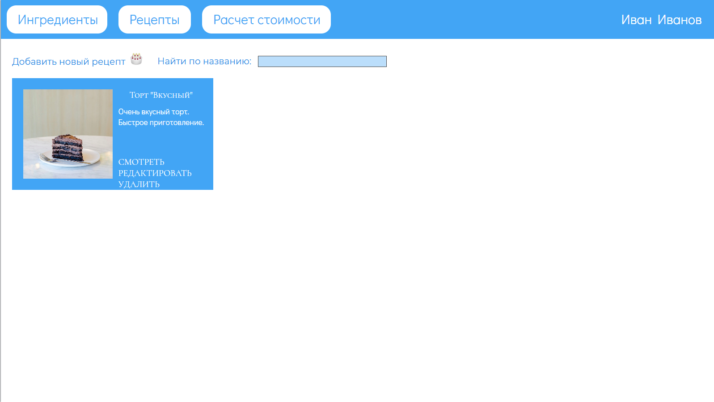

# recipe-book

Recipe book - приложение, в котором пользователи могут хранить свои рецепты.

Задача приложения - предоставить хранение рецептов, сформировать список покупок для приготовления того или иного блюда, рассчитать стоимость ингредиентов.

## Визуальная схема фронтэнда

## Документация

1. Маркетинг и аналитика
   1. [Целевая аудитория](./docs/01-biz/01-target-audience.md)
   2. [Заинтересанты](./docs/01-biz/02-stakeholders.md)
   3. [Пользовательские истории](./docs/01-biz/03-bizreq.md)
2. Аналитика
   1. [Функциональные требования](./docs/02-analysis/01-functional-requirements)
   2. [Нефункциональные требования](./docs/02-analysis/02-nonfunctional-requirements.md)
   3. [Требования к MVP](./docs/02-analysis/03-mvp-requirements.md)
3. Архитектура
   1. [Архитектура приложения](./docs/03-arch/01-architecture.md)
4. DevOps
   1. [Файлы сборки](./deploy)
5. Тесты
